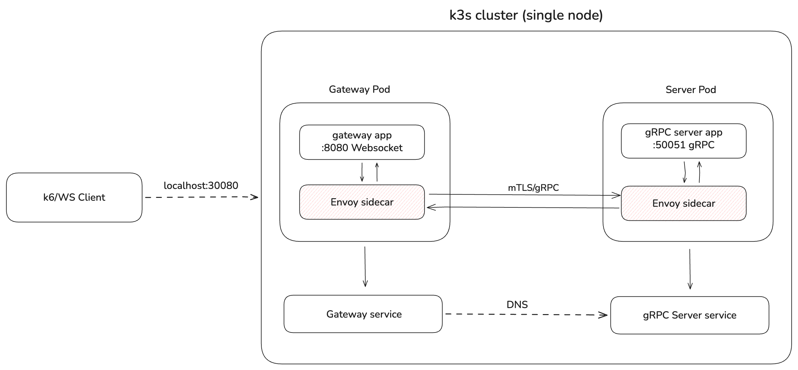

### Introduction

Real-time data streaming is a crucial component of modern network applications. However, maintaining persistent, low-latency communication between web clients and distributed backend services introduces complex state and concurrency challenges. This small independent project presents a bidirectional messaging gateway architecture that bridges client-facing WebSockets with backend gRPC streams, implemented in Go and deployed on Kubernetes using k3s. This project also quantifies the latency overhead introduced at both the WebSocket and gRP layers under unary and bidirectional streaming patterns, with and without a traffic-handling proxy for container applications (Envoy)
intercepting inter-service traffic.

### Gateway & Protocols

WebSocket (WS) is a browser-native HTTP/1.1 protocol for full-duplex communication, while gRPC is an HTTP/2 RPC framework. The gateway bridges these incompatible protocols, allowing WS to use gRPC services. Benchmarks were conducted using Grafana k6 with 50 concurrent virtual users (VUs) over a total duration of 10 seconds.

### Baseline Architecture

**Note**: <small> A hub manager registers/unregister a new WS client. During a client registration, two goroutines (read/write pump) are created to handle concurrent send/receive. For Bidi mode, the architecture is similar  but includes a new goroutine for receiving streams. </small>

* The bidirectional streaming architecture demonstrates a 74.85% reduction in gateway overhead and an 88.9% reduction in end-to-end ping-pong latency compared to the unary implementation at median (p50).
* We observe a higher throughput of 21,066/s with the bidirectional architecture, compared to 13,939/s for the unary approach, an increase of approximately 51.2%.

This performance gap is likely attributed to bidirectional streaming's single connection establishment with one-time HTTP/2 header frame negotiation, followed by length-prefixed message transmission terminated by a single end-of-stream (EOS) flag. In contrast, unary calls incur per-request header frame overhead and an individual EOS for every transmitted message [1]. However, further testing would be required to confirm the extent to which these factors contribute to the observed difference.

### K3s Cluster & Sidecar Proxy

For the K3s environment performance analysis, we focused on the bidirectional streaming architecture due to its improved performance. To evaluate bidirectional streaming latency in a realistic distributed systems environment, both services were
containerized and deployed on a single-node K3s cluster. We first established a no-mesh baseline to isolate infrastructure overhead, then enabled Istio sidecar injection (profile=minimal) to deploy an Envoy proxy alongside each service. The goal is to quantify the latency cost introduced by the additional network hops
and mTLS (mutual TLS) processing inherent to the sidecar pattern.

**Note**: <small> K3s architecture diagram with Sidecar proxy. Note that since the entire cluster runs on a single-node EC2 instance, the Istio control plane (istiod) shares compute resources with the data plane services, which may introduce additional overhead not representative of a production multi-node deployment.</small>

* The K3s affects bidirectional streaming performance by -84.1% compared to baseline latency without K3s. Following Istio Sidecar Proxy injection, we notice a performance impact of -62.5% compared to K3s baseline performance with no service mesh.

* We observe a drop in data rate from 21,066/s to 12,572/s, approximately
-40.32%. After Istio integration, we observe a drop in throughput from 12,572/s to 7,047/s, approximately -43.94%.

### Conclusion & ongoing work

Bidirectional streaming demonstrated better performance than unary, achieving an 88.9% reduction in end-to-end latency at median. Containerized deployment on K3s introduced additional overhead, further compounded by Istio sidecar injection, resulting in a 44% throughput reduction and 167% latency increase over the no-mesh baseline. Future work includes multi-node deployment to isolate the control plane from data
plane services, and extending the analysis to Istio ambient mode, which replaces the per-pod sidecar with a node-level Layer 4 proxy called ztunnel, potentially reducing mesh overhead significantly.

### References

[1] [https://github.com/himanshu-patel-dev/gRPC/blob/main/under_the_hood/README.md](https://github.com/himanshu-patel-dev/gRPC/blob/main/under_the_hood/README.md)
