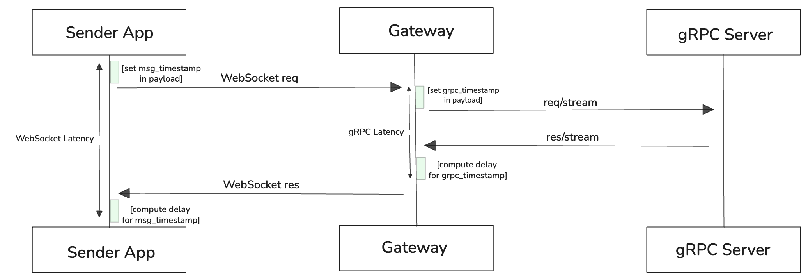
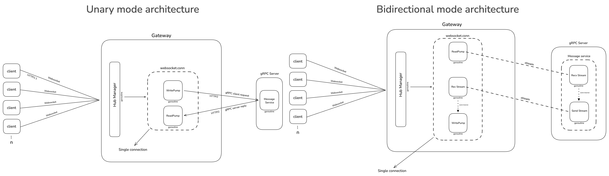

## Introduction

Real-time data streaming is a crucial component of modern network applications. However, maintaining persistent, low-latency communication between web clients and distributed backend services introduces complex state and concurrency challenges. This independent project presents a bidirectional messaging gateway architecture that bridges client-facing WebSockets with backend gRPC streams, implemented in Go and deployed on Kubernetes using k3s. This study quantifies the latency overhead introduced at both the WebSocket and gRP layers under unary and bidirectional streaming patterns, with and without a traffic-handling proxy for container applications (Envoy)
intercepting inter-service traffic.

## Gateway & Protocols

WebSocket (WS) is a browser-native HTTP/1.1 protocol for full-duplex communication, while gRPC is an HTTP/2 RPC framework. The gateway bridges these incompatible protocols, allowing WS to use gRPC services.

Benchmarks were conducted using Grafana k6 with 50 concurrent virtual users (VUs) over a total duration of 10 seconds. Both baseline architectures were implemented and evaluated on the Middlebury College Ada cluster, while all K3s-related components were deployed and tested on Amazon EC2.

## Baseline Architecture

